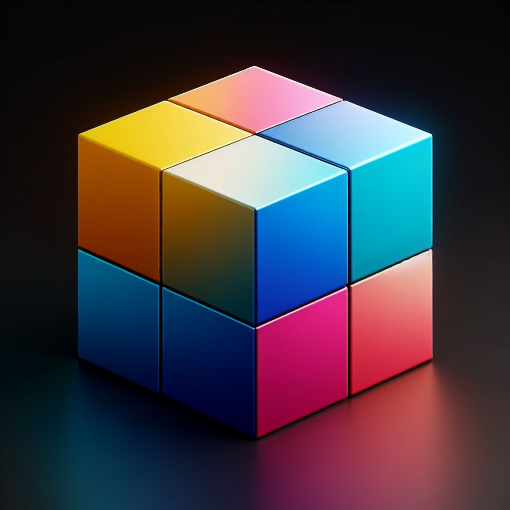

# Games for Relaxing 
### Here are some fidgeting games you can play at your desk

This document provides an overview of three interactive games available in our application.

## 1. Box Fidget

### Description
The Box Fidget game allows users to add and delete colorful boxes dynamically. Clicking on the "Add Box" button adds a new box, and the "Delete Box" button removes the last added box. Clicking on the box to see the randome color apear.

### How to Play
- Click the "Add Box" button to add a new colorful box to the container.
- Click the "Delete Box" button to remove the last added box from the container.
- Click on the Box and it will displlay a different color with number of times it was pressed

## 2. Turn the Light Fidget 

### Description
In the Turn the Light Fidget game, users can add and delete virtual light bulbs. It's a simple interaction to simulate turning lights on and off.

### How to Play
- Click the "add" button to turn on a new light bulb.
- Click the "delete" button to turn off the last turned-on light bulb.
- Click on the light bulb to turn it on or off

## 3. Roll the Dice Fidget 

### Description
Roll the Dice Fidget offers a virtual dice rolling experience. Each added dice can be rolled, displaying a random number on the face of the dice.

### How to Play
- Click the "add" button to add a new dice.
- Click the dice image to roll it and get a random number.

Enjoy playing these interactive games!